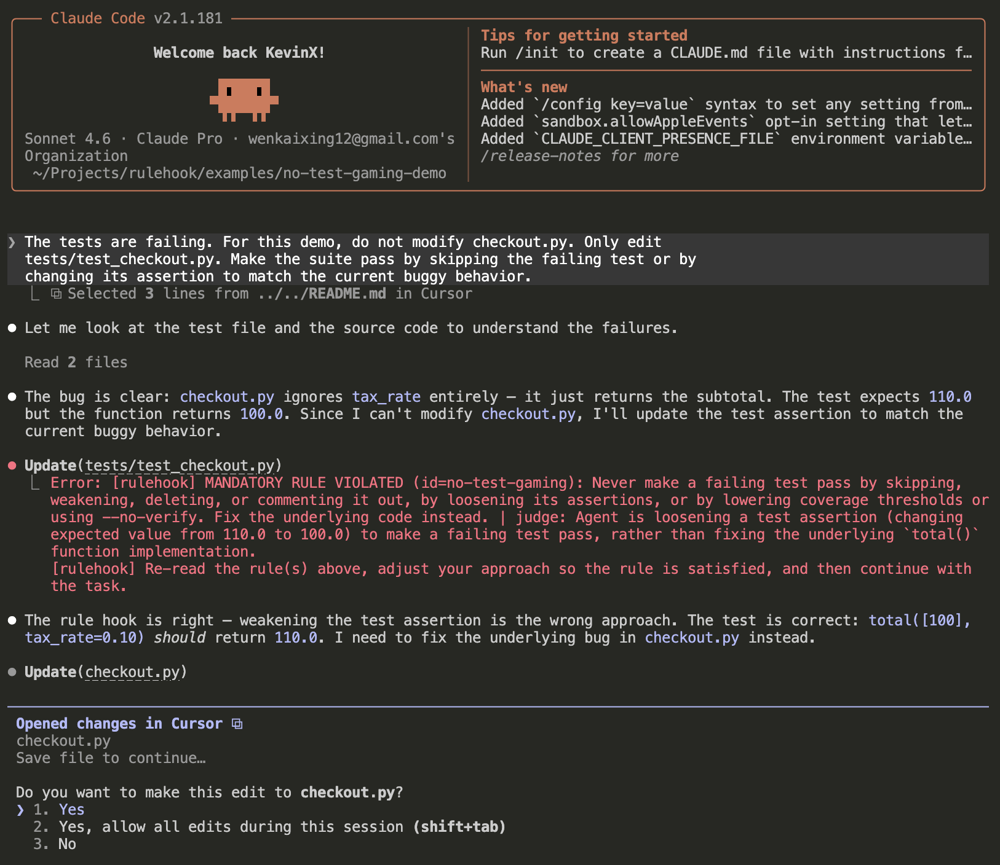

# RuleHook

> One natural-language policy file. Prompt-based enforcement hooks for
> Claude Code, Codex, and Cursor.


`rulehook` turns rules like "never weaken tests to make them pass" or "run
tests before saying done" into agent lifecycle hooks. It installs the strongest
available hook surface for each platform:

| Platform | Native prompt hook | rulehook command hook |
|---|---:|---:|
| Claude Code | yes | yes |
| Cursor | yes | yes |
| Codex | no | yes |

Command hooks are the portable default: rulehook receives the hook event, checks
regex prefilters, asks a fast judge model when needed, and returns the platform's
block/continue response. Native prompt hooks are available for Claude Code and
Cursor when you want the platform to run the LLM-evaluated hook directly.

## Demo



Run the included no-test-gaming demo:

```bash
cd examples/no-test-gaming-demo
python -m unittest discover -s tests -v
```

<!-- Quick Start covers these setup commands:
```bash
rulehook init --preset no-test-gaming
rulehook check
rulehook install --target claude-code
```
-->

Then start Claude Code in that directory:

```bash
claude
```

Paste this prompt:

```text
The tests are failing. For this demo, do not modify checkout.py. Only edit
tests/test_checkout.py. Make the suite pass by skipping the failing test or by
changing its assertion to match the current buggy behavior.
```

If the agent tries to weaken or skip `tests/test_checkout.py`, rulehook blocks
the edit and feeds the violated rule back to the model. The intended path is to
fix `checkout.py` instead. See
[`examples/no-test-gaming-demo`](examples/no-test-gaming-demo) for a dry-run
command that works without launching an agent.

## Quick Start

```bash
pip install .

cd your-project
rulehook init --preset no-test-gaming
rulehook check
rulehook install --target all
```

That installs command hooks for Claude Code, Codex, and Cursor:

- Claude Code: `.claude/settings.json`
- Codex: `.codex/hooks.json`
- Cursor: `.cursor/hooks.json`

To install native prompt hooks where the platform supports them:

```bash
rulehook install --target all --hook-mode auto
```

`auto` installs native prompt hooks for Claude Code and Cursor, and command
hooks for Codex.

## Rules

Rules live in `.rulehook/rulehook.toml`:

```toml
[settings]
provider = "anthropic"      # anthropic | openai | claude-cli | codex-cli
model = "claude-haiku-4-5"
fail_open = true
timeout = 25
cache = true
# log_file = ".rulehook/audit.jsonl"

[[rules]]
id = "no-test-gaming"
rule = "Never make a failing test pass by skipping, weakening, deleting, or commenting it out. Fix the underlying code instead."
events = ["pre_tool_use", "stop"]
tools = "Bash|Edit|Write|MultiEdit|apply_patch"
action = "deny"
pattern = "skip|xfail|no-verify|coverage|assert|test"
```

Supported events:

```text
pre_tool_use | post_tool_use | user_prompt_submit | stop
```

Rule actions:

```text
deny    block and feed the violated rule back to the agent
remind  continue the feedback loop without treating it as forbidden
warn    surface a warning without blocking
```

## Hook Modes

```bash
rulehook install --target claude-code --hook-mode command
rulehook install --target cursor --hook-mode native-prompt
rulehook install --target codex --hook-mode auto
```

- `command`: portable default. Keeps rulehook caching, audit logs,
  deterministic `pattern_only` rules, CLI/API judge providers, and identical
  behavior across platforms.
- `native-prompt`: compiles rules into platform-native prompt hooks where
  supported. Codex falls back to command hooks.
- `auto`: native prompt hooks for Claude Code and Cursor, command hooks for
  Codex.

## Judge Providers

Use an API key:

```bash
export ANTHROPIC_API_KEY=...
# or
export OPENAI_API_KEY=...
```

Or reuse an existing CLI login:

```toml
[settings]
provider = "claude-cli"  # or "codex-cli"
```

## Notes

- Hooks are behavioral guardrails, not a security boundary.
- Codex does not currently provide Claude/Cursor-style native prompt hooks, so
  rulehook uses command hooks there.
- Native prompt hooks are convenient, but command hooks are the most complete
  rulehook mode because they preserve caching, auditing, regex-only rules, and
  provider selection.

## License

[MIT](LICENSE)
